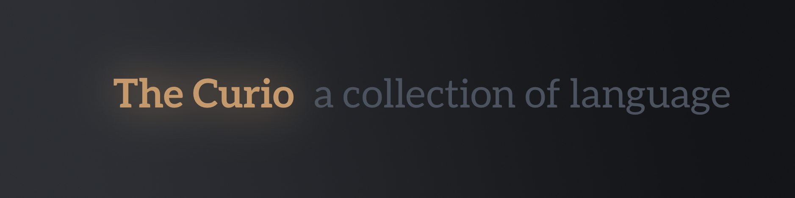
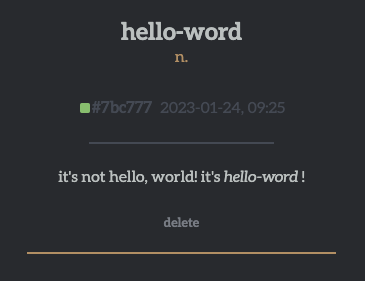

<div align="center" style="display:flex;flex-direction:column;">
  <a href="https://curio.lightblog.dev">
    
  </a>
  <h2>a user-created light-hearted dictionary-of-sorts</h2>
</div>

## 🖋️ The Curio (curio.lightblog.dev)

Welcome to The Curio!

The Curio is an open dictionary similar to Urban Dictionary. The Curio focuses on wholesome, lighthearted, and fun wordplay.  

The intentionally minimal design is designed to highlight individual words and their definitions (and also because CSS is hard).



## 🔍 Why?

I really like website concepts such as [Urban Dictionary](https://www.urbandictionary.com), but the content that I enjoy reading the most is on sites such as [ThisWebsiteWillSelfDestruct](https://www.thiswebsitewillselfdestruct.com). I decided to make The Curio as a bridge between the two, a collection of user-submitted words with little to no interaction that also facilitates a wholesome and honest message.

## 🔩 TODO

> Features are minimal right now, but I plan on adding more as I find the time.

- [ ] 🤸 Working random document feature

- [ ] 🔗 Connect full-text search backend

- [ ] 🧹 Clean up client-side code

- [ ] 🦾 Make site more accesible + improve mobile view

- [X] 🚨 Improve backend security

## 🛠️ Contributing

Contributions are always welcome! If you spot an issue in the website also feel free to file an issue. I promise I'm not a cranky dev who hates people filing issues.

### ⚡️Setup

```bash
# Clone this repository
git clone https://github.com/secondary-smiles/curio.git

cd curio

# Make new branch for your feature/fix/whatever
git checkout -b <my/awesome-branch>
```

### 💨 Dev Setup

```bash
yarn
yarn dev
```
